# Hybrid Triple Storage Architecture

SmartMemory implements a **hybrid triple storage architecture** that combines three complementary storage systems to provide optimal performance, flexibility, and intelligence. This architecture enables sophisticated memory operations while maintaining high performance and scalability.

## Architecture Overview

```mermaid
flowchart TD
    A["🧠 Memory Item"] --> B["📊 Storage Router"]
    
    B --> C["💾 Graph Database"]
    B --> D["🗂️ Vector Store"]
    B --> E["📋 Metadata Store"]
    
    subgraph "Graph Database Layer"
        C --> C1["🔗 Entity Relationships"]
        C --> C2["🌐 Knowledge Graph"]
        C --> C3["📈 Graph Analytics"]
        C --> C4["🔍 Path Finding"]
    end
    
    subgraph "Vector Store Layer"
        D --> D1["🎯 Semantic Embeddings"]
        D --> D2["🔍 Similarity Search"]
        D --> D3["📊 Vector Operations"]
        D --> D4["🧮 Clustering"]
    end
    
    subgraph "Metadata Store Layer"
        E --> E1["⏰ Temporal Information"]
        E --> E2["👤 User Context"]
        E --> E3["🏷️ Classification Tags"]
        E --> E4["📊 Quality Metrics"]
    end
    
    style A fill:#e3f2fd,stroke:#1976d2,stroke-width:3px
    style C fill:#e8f5e8,stroke:#388e3c,stroke-width:2px
    style D fill:#fff3e0,stroke:#f57c00,stroke-width:2px
    style E fill:#f3e5f5,stroke:#7b1fa2,stroke-width:2px
```



## Storage Components

### 🌐 Graph Database Layer

**Primary Functions:**
- Entity Storage: People, places, concepts, and objects
- Relationship Mapping: Semantic, temporal, and causal relationships
- Knowledge Graph: Structured representation of domain knowledge
- Path Analysis: Finding connections between distant entities

**Supported Backends:**
- **FalkorDB** (Recommended): Redis-based graph database
- **Neo4j**: Enterprise-grade graph database
- **In-Memory**: Development and testing backend

### 🎯 Vector Store Layer

**Primary Functions:**
- Semantic Embeddings: Dense vector representations
- Similarity Search: Finding semantically related memories
- Clustering: Grouping similar memories automatically
- Dimensionality Operations: Efficient storage and retrieval

**Supported Backends:**
- **ChromaDB** (Default): Open-source vector database
- **Pinecone**: Managed vector database
- **Weaviate**: Vector database with ML capabilities

### 📋 Metadata Store Layer

**Primary Functions:**
- Temporal Data: Creation time, modification history
- User Context: User-specific information, permissions
- Classification: Memory types, quality scores
- System Metadata: Indexing information, statistics

## Query Processing

```mermaid
flowchart LR
    A["🔍 Query"] --> B["📊 Query Analyzer"]
    B --> C["🎯 Storage Selection"]
    
    C --> D["💾 Graph Query"]
    C --> E["🗂️ Vector Search"]
    C --> F["📋 Metadata Filter"]
    
    D --> G["🔄 Result Fusion"]
    E --> G
    F --> G
    
    G --> H["📤 Unified Response"]
    
    style A fill:#e3f2fd,stroke:#1976d2,stroke-width:2px
    style G fill:#fff3e0,stroke:#f57c00,stroke-width:2px
    style H fill:#e8f5e8,stroke:#388e3c,stroke-width:2px
```



## Benefits of Hybrid Architecture

| Aspect | Benefit | Implementation |
|--------|---------|----------------|
| **Performance** | Optimal query performance | Each storage type optimized for specific operations |
| **Scalability** | Independent scaling | Each layer can scale based on workload |
| **Flexibility** | Multiple query patterns | Graph traversal, semantic search, metadata filtering |
| **Reliability** | Fault tolerance | Redundancy across storage types |
| **Intelligence** | Rich data relationships | Combines structural and semantic understanding |

## Use Cases

### 🔍 **Semantic Search**
```python
# Uses vector store for similarity matching
results = memory.search("machine learning algorithms", similarity_threshold=0.8)
```

### 🌐 **Relationship Discovery**
```python
# Uses graph database for path finding
connections = memory.find_connections("John", "TechCorp", max_hops=3)
```

### ⏰ **Temporal Queries**
```python
# Uses metadata store for time-based filtering
recent_memories = memory.search_by_timerange(
    start_date="2024-01-01",
    end_date="2024-01-31"
)
```

### 🎯 **Complex Queries**
```python
# Combines all three storage layers
results = memory.complex_search(
    semantic_query="Python programming",
    relationship_filter={"connected_to": "work_projects"},
    temporal_filter={"last_30_days": True},
    user_context={"skill_level": "intermediate"}
)
```

## Configuration

```json
{
  "storage": {
    "graph": {
      "backend": "FalkorDBBackend",
      "host": "localhost",
      "port": 6379,
      "graph_name": "smartmemory"
    },
    "vector": {
      "backend": "ChromaDBBackend",
      "persist_directory": "./chroma_db",
      "collection_name": "memories"
    },
    "metadata": {
      "backend": "JSONFileBackend",
      "storage_path": "./metadata"
    }
  }
}
```

This hybrid architecture enables SmartMemory to provide both the structural intelligence of graph databases and the semantic understanding of vector stores, while maintaining efficient metadata operations for optimal performance.
