# Core Concepts

> 📚 **Repository**: [smartmemory-ai/smart-memory](https://github.com/smart-memory/smart-memory)  
> 🐛 **Issues**: [Report bugs or request features](https://github.com/smart-memory/smart-memory/issues)

Understanding SmartMemory's core concepts is essential for building effective memory-enabled applications. This guide covers the fundamental principles and components that make SmartMemory powerful.

## Memory Architecture

SmartMemory implements a **unified memory architecture** that combines multiple memory types with intelligent processing capabilities. Unlike traditional storage systems, SmartMemory doesn't just store data—it understands, connects, and evolves your information.

```mermaid
graph TD
    A["📝 Raw Input"] --> B["🔍 Content Analysis"]
    B --> C["🏷️ Type Classification"]
    
    C --> D{"Memory Type?"}
    D -->|Facts| E["🔍 Semantic Memory"]
    D -->|Events| F["📚 Episodic Memory"]
    D -->|Skills| G["⚙️ Procedural Memory"]
    D -->|Active| H["💭 Working Memory"]
    
    E --> I["💾 Graph Database"]
    F --> I
    G --> I
    H --> I
    
    I --> J["🔗 Relationship Mapping"]
    I --> K["📊 Semantic Indexing"]
    I --> L["⏰ Temporal Ordering"]
    
    J --> M["🧬 Evolution Engine"]
    K --> M
    L --> M
    
    M --> N["🎯 Smart Retrieval"]
    M --> O["📈 Quality Enhancement"]
    M --> P["🔄 Continuous Learning"]
    
    N --> Q["📤 Contextual Results"]
    O --> Q
    P --> Q
    
    style A fill:#e3f2fd,stroke:#1976d2,stroke-width:2px
    style I fill:#f3e5f5,stroke:#7b1fa2,stroke-width:2px
    style M fill:#fff3e0,stroke:#f57c00,stroke-width:2px
    style Q fill:#e8f5e8,stroke:#388e3c,stroke-width:2px
```



### The Four Memory Types

#### 1. Semantic Memory
**What it stores**: Facts, concepts, and general knowledge that are independent of personal experience.

```python
# Examples of semantic memory
memory.ingest("Python is a programming language")
memory.ingest("The capital of France is Paris")
memory.ingest("Machine learning is a subset of AI")
```

**Characteristics**:
- Timeless factual information
- Shared knowledge across users
- Structured relationships between concepts
- High connectivity with other facts

#### 2. Episodic Memory
**What it stores**: Personal experiences and events with temporal and contextual information.

```python
# Examples of episodic memory
memory.ingest("I attended the AI conference in San Francisco last week")
memory.ingest("Had lunch with Sarah at the Italian restaurant yesterday")
memory.ingest("Completed my first Python project in 2020")
```

**Characteristics**:
- Time-bound experiences
- Personal and contextual
- Rich in emotional and sensory details
- Connected to specific locations and people

#### 3. Procedural Memory
**What it stores**: Skills, procedures, and how-to knowledge.

```python
# Examples of procedural memory
memory.ingest("To deploy to AWS: 1) Build image 2) Push to ECR 3) Update ECS")
memory.ingest("Git workflow: branch → commit → push → PR → merge")
memory.ingest("Morning routine: exercise → shower → coffee → emails")
```

**Characteristics**:
- Step-by-step instructions
- Action sequences and workflows
- Skill-based knowledge
- Executable procedures

#### 4. Working Memory
**What it stores**: Temporary information that's currently being processed or actively used.

```python
# Examples of working memory
memory.ingest("Currently debugging the authentication issue")
memory.ingest("Meeting with team at 3 PM today")
memory.ingest("Need to review PR #123 before EOD")
```

**Characteristics**:
- Temporary and context-dependent
- High priority for immediate access
- Frequently updated or replaced
- Limited capacity by design

### Memory Type Interactions

```mermaid
graph TD
    subgraph "Memory Types"
        S1["🔍 Semantic Memory<br/>Facts & Concepts"]
        E1["📚 Episodic Memory<br/>Personal Events"]
        P1["⚙️ Procedural Memory<br/>Skills & Procedures"]
        W1["💭 Working Memory<br/>Active Tasks"]
    end
    
    S1 --> INT1["Cross-Memory Relationships"]
    E1 --> INT1
    P1 --> INT1
    W1 --> INT1
    
    INT1 --> REL1["🔗 Provides Context"]
    INT1 --> REL2["🎯 Applied In Experiences"]
    INT1 --> REL3["📚 References Knowledge"]
    INT1 --> REL4["⚙️ Uses Skills"]
    
    REL1 --> EV["Evolution Patterns"]
    REL2 --> EV
    REL3 --> EV
    REL4 --> EV
    
    EV --> EV1["🧬 Consolidation"]
    EV --> EV2["🔗 Link Formation"]
    EV --> EV3["📊 Quality Assessment"]
    
    style S1 fill:#e3f2fd,stroke:#1976d2,stroke-width:2px
    style E1 fill:#fff3e0,stroke:#f57c00,stroke-width:2px
    style P1 fill:#f3e5f5,stroke:#7b1fa2,stroke-width:2px
    style W1 fill:#e8f5e8,stroke:#388e3c,stroke-width:2px
```



### Intelligent Processing Pipeline

### 1. Ingestion Flow

When you add information to SmartMemory, it goes through a sophisticated processing pipeline:

```
Input → Adaptation → Classification → Extraction → Linking → Grounding → Enrichment → Storage
```

#### Adaptation
Converts various input formats (text, structured data, objects) into a standardized `MemoryItem` format.

#### Classification
Determines the appropriate memory type (semantic, episodic, procedural, working) based on content analysis.

#### Extraction
Identifies entities, relationships, and semantic patterns using NLP and LLM techniques.

#### Linking
Discovers connections with existing memories using similarity analysis and relationship detection.

#### Grounding
Establishes provenance by linking memories to their external sources. This enables:
- **Source verification**: Track where information came from
- **Fact checking**: Validate against authoritative sources  
- **Audit trails**: Maintain transparency for AI decisions
- **Quality assurance**: Associate confidence and validation metadata

```python
# Grounding can be done automatically during ingestion
memory.add("Paris is the capital of France", context={
    "source_url": "https://wikipedia.org/wiki/Paris",
    "confidence": 0.95
})

# Or manually after the fact
memory.ground("fact_123", "https://authoritative-source.com")
```

#### Enrichment
Enhances the memory with additional context, metadata, and derived information.

#### Storage
Persists the enriched memory in graph and vector databases with proper indexing.

### 2. Entity and Relationship Extraction

SmartMemory automatically identifies and extracts structured information:

```python
# Input
memory.add("John Smith works at Google as a software engineer")

# Extracted entities
entities = [
    {"name": "John Smith", "type": "PERSON"},
    {"name": "Google", "type": "ORGANIZATION"},
    {"name": "software engineer", "type": "JOB_TITLE"}
]

# Extracted relationships
relationships = [
    {"source": "John Smith", "target": "Google", "type": "WORKS_AT"},
    {"source": "John Smith", "target": "software engineer", "type": "HAS_ROLE"}
]
```

### 3. Automatic Linking

SmartMemory creates intelligent connections between memories:

- **Semantic similarity**: Memories with similar meaning
- **Entity overlap**: Memories sharing common entities
- **Temporal proximity**: Memories from similar time periods
- **Contextual relevance**: Memories from similar contexts

## Evolution Algorithms

SmartMemory continuously improves itself through evolution algorithms:

### 1. Maximal Connectivity Evolver
Creates dense, high-quality connections between related memories.

```python
# Before evolution
Memory A: "Python programming"
Memory B: "Data science projects"
# No connection

# After evolution
Memory A ←→ Memory B (USED_FOR relationship)
```

### 2. Rapid Enrichment Evolver
Immediately enhances memories with comprehensive context and metadata.

### 3. Strategic Pruning Evolver
Removes redundant or low-value memories while preserving important information through consolidation.

### 4. Hierarchical Organization Evolver
Creates hierarchical structures for efficient navigation and retrieval.

## Similarity Framework

SmartMemory uses a multi-dimensional similarity framework to understand relationships:

### Similarity Metrics

1. **Semantic Similarity**: Meaning-based comparison using embeddings
2. **Content Similarity**: Text-based overlap and patterns
3. **Temporal Similarity**: Time-based relationships
4. **Metadata Similarity**: Structural and categorical similarities

### Weighted Scoring

```python
total_similarity = (
    semantic_similarity * 0.4 +
    content_similarity * 0.3 +
    temporal_similarity * 0.2 +
    metadata_similarity * 0.1
)
```

## Graph-Based Storage

SmartMemory uses graph databases to model complex relationships:

### Node Types
- **Memory Nodes**: Individual memories with content and metadata
- **Entity Nodes**: Extracted entities (people, places, concepts)
- **Concept Nodes**: Abstract concepts and categories

### Relationship Types
- **RELATED_TO**: General semantic relationships
- **CONTAINS**: Hierarchical containment
- **PRECEDES/FOLLOWS**: Temporal sequences
- **CAUSED_BY/CAUSES**: Causal relationships
- **PART_OF/HAS_PART**: Compositional relationships

### Graph Queries

```python
# Find all memories related to "Python"
related_memories = memory.get_neighbors("python_concept_id")

# Get temporal sequence
sequence = memory.get_links("event_id", link_type="PRECEDES")

# Find causal chains
causes = memory.get_links("outcome_id", link_type="CAUSED_BY")
```

## Background Processing

SmartMemory supports asynchronous processing for better performance:

### Fast Ingestion

```python
# Store immediately, process in background
memory.ingest("Important information that needs immediate storage")
```

### Processing Queue
- **Priority-based**: Important memories processed first
- **Batch processing**: Efficient bulk operations
- **Retry logic**: Handles temporary failures
- **Health monitoring**: Tracks processing status

## Ontology Management

SmartMemory supports structured knowledge organization:

### Ontology Components
- **Entity Types**: Definitions of entity categories
- **Relationship Types**: Allowed relationship patterns
- **Validation Rules**: Constraints and consistency checks
- **Inheritance Hierarchies**: Type hierarchies and specialization

### Hybrid Approach
- **Freeform extraction**: Automatic, flexible entity discovery
- **Ontology-guided**: Structured, validated knowledge organization
- **Seamless migration**: Evolution from freeform to structured

## Search and Retrieval

SmartMemory provides multiple search strategies:

### Search Types
1. **Semantic Search**: Meaning-based retrieval using embeddings
2. **Graph Search**: Relationship-based traversal
3. **Hybrid Search**: Combined semantic and graph approaches
4. **Filtered Search**: Type-specific or metadata-filtered results

### Search Context
```python
# Context-aware search
results = memory.search(
    query="machine learning",
    memory_type="semantic",
    top_k=10
)

# Note: User/tenant filtering is handled automatically by ScopeProvider
# in multi-tenant deployments. Time-range filtering can be done post-search.
```

## Component Architecture

SmartMemory follows a modular, component-based architecture:

### Core Components
- **CRUD**: Create, Read, Update, Delete operations
- **Search**: Multi-strategy search implementation
- **Linking**: Relationship discovery and management
- **Enrichment**: Memory enhancement and context addition
- **Evolution**: Memory optimization algorithms
- **Monitoring**: Performance and health tracking

### Benefits
- **Modularity**: Easy to extend and customize
- **Testability**: Components can be tested in isolation
- **Flexibility**: Mix and match components as needed
- **Maintainability**: Clear separation of concerns

## Integration Patterns

### Tool-Based Integration
SmartMemory provides tools for agentic workflows:

```python
# MCP tools for LLM agents
tools = [
    "memory_add",
    "memory_search", 
    "memory_get",
    "memory_update",
    "memory_delete"
]
```

### API Integration
RESTful APIs for web applications and services.

### Library Integration
Direct Python library usage for embedded applications.

## Performance Considerations

### Scalability
- **Horizontal scaling**: Multiple worker processes
- **Vertical scaling**: Optimized algorithms and data structures
- **Caching**: Intelligent caching strategies
- **Indexing**: Efficient search indexes

### Optimization
- **Lazy loading**: Load data only when needed
- **Batch operations**: Process multiple items efficiently
- **Connection pooling**: Reuse database connections
- **Memory management**: Efficient memory usage patterns

## Best Practices

1. **Choose appropriate memory types** for your data
2. **Enable background processing** for better performance
3. **Use structured data** when possible for better extraction
4. **Monitor evolution algorithms** to ensure quality
5. **Configure similarity weights** for your use case
6. **Implement proper error handling** for robustness
7. **Use caching** for frequently accessed data

## Next Steps

- [Memory Types](memory-types) - Detailed guide to each memory type
- [Ingestion Flow](ingestion-flow) - Deep dive into the processing pipeline
- [Evolution Algorithms](evolution-algorithms) - Understanding memory optimization
- [Similarity Framework](similarity-framework) - Advanced similarity concepts
