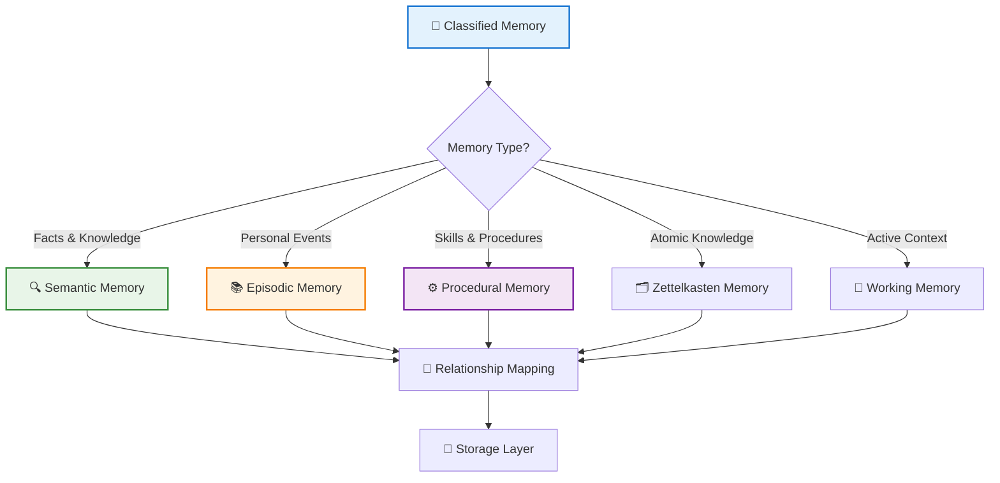
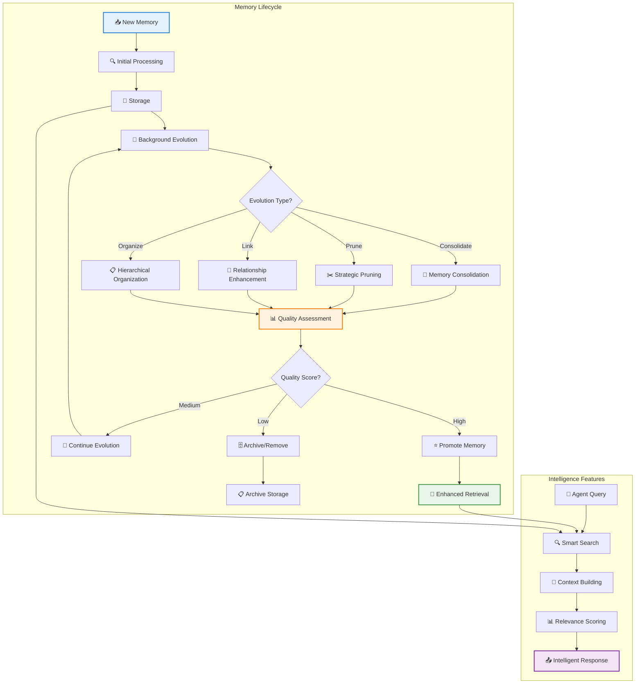
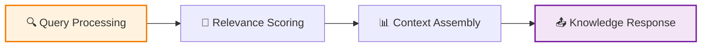
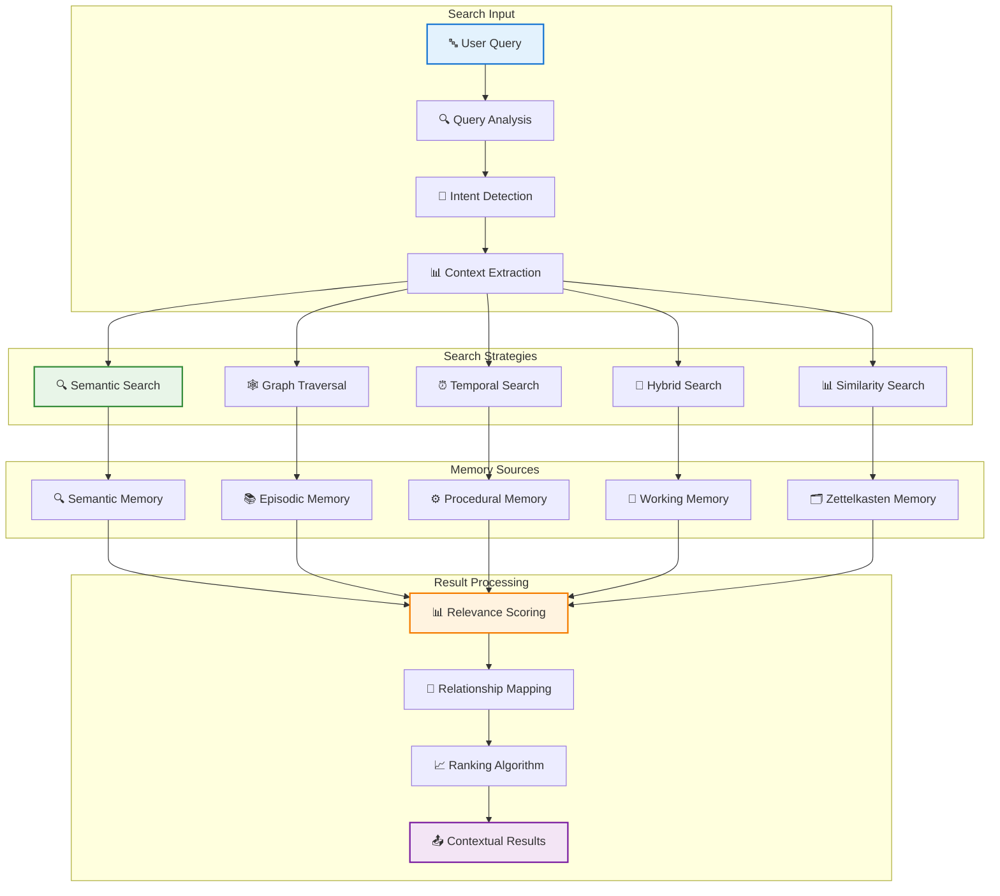
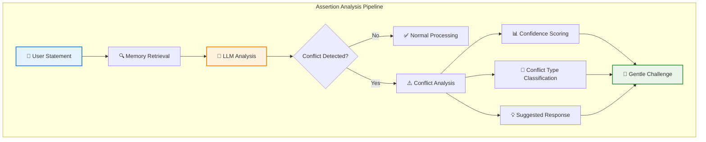
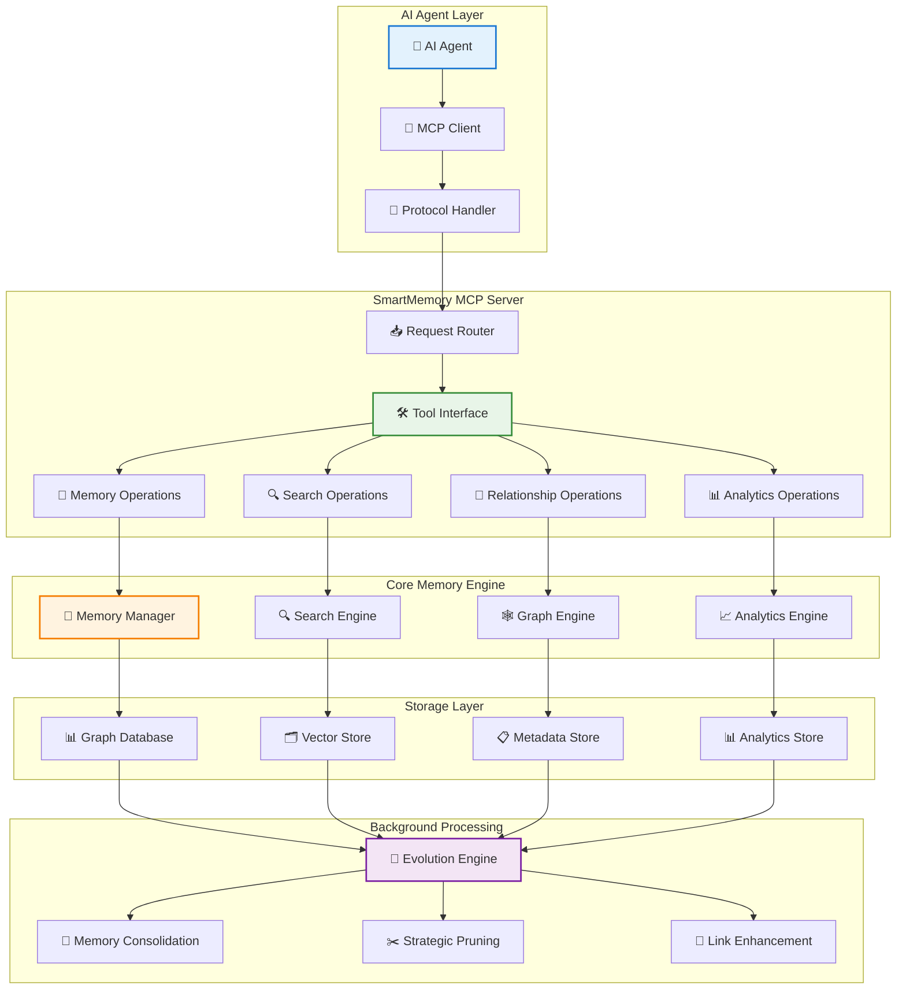
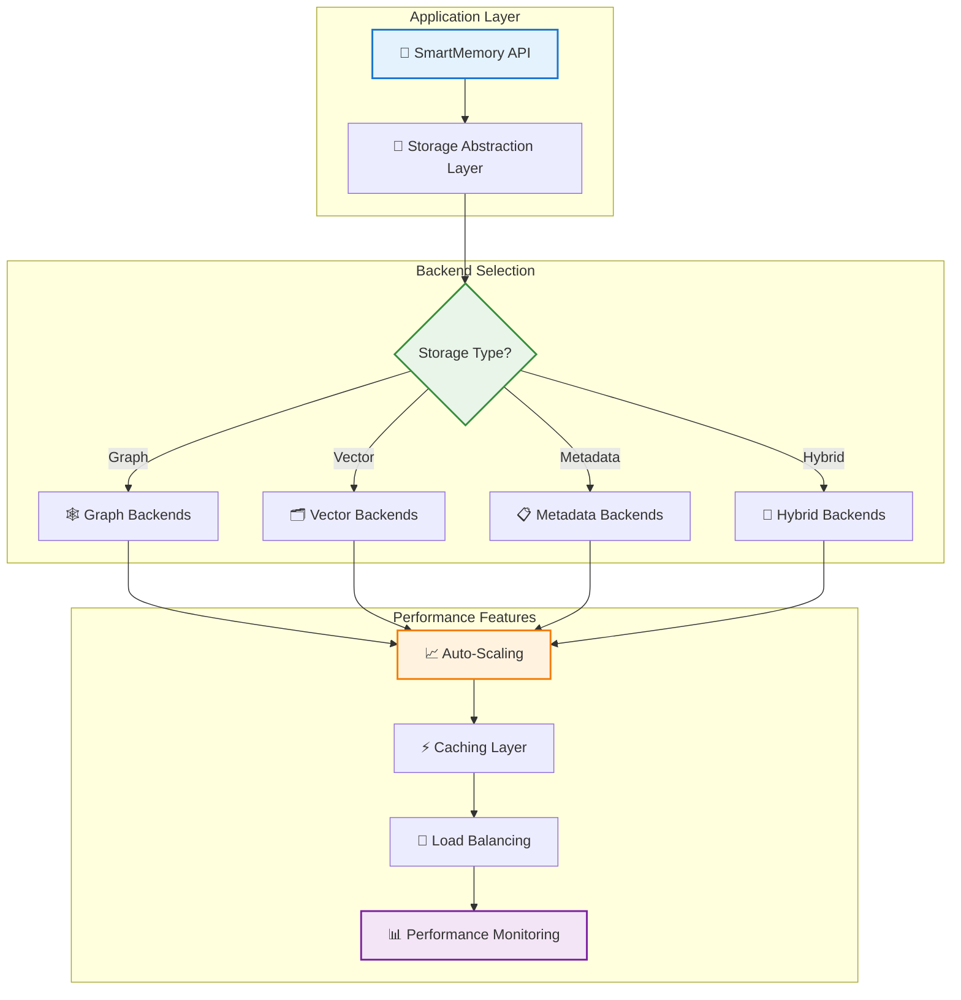
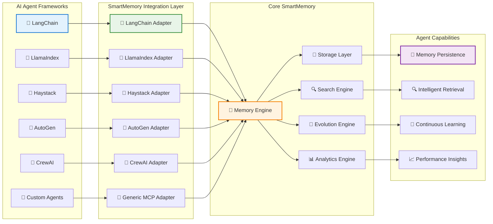

# SmartMemory Documentation

> 📚 **Repository**: [smartmemory-ai/smart-memory](https://github.com/smart-memory/smart-memory)  
> 🐛 **Issues**: [Report bugs or request features](https://github.com/smart-memory/smart-memory/issues)  
> 📖 **Documentation**: [View online docs](https://smartmemory-ai.github.io/smart-memory/)

:::info
🧠 **SmartMemory** - Advanced Agentic Memory System for Intelligent Applications with Enterprise-Grade Multi-User Support
:::

---

## 🚀 What is SmartMemory?

SmartMemory is a **next-generation memory system** that goes far beyond simple storage and retrieval. It's designed specifically for **AI agents and intelligent applications** that need sophisticated memory capabilities with human-like cognitive processing, **complete user isolation**, and **intelligent assertion challenging**.

### 🌟 Key Features

- **🧠 Cognitive Memory Types**: Working, semantic, episodic, and procedural memory systems
- **🔄 Automatic Evolution**: Memories improve and consolidate over time
- **🎯 Intelligent Assertion Challenging**: LLM-based semantic analysis to detect and address contradictory statements
- **🔍 Semantic Search**: Find information by meaning, not just keywords
- **🌐 Framework Integration**: Works with LangChain, CrewAI, AutoGen, and more

---

## 🧠 **Memory Type Distribution**

SmartMemory organizes information into five distinct cognitive memory types, each optimized for different kinds of knowledge and usage patterns, mimicking human cognitive architecture.



### 🧬 **Memory Evolution & Intelligence**

Memory improves itself in the background while you continue chatting.  Memories consolidate, prune, and enhance relationships as well as create new memories to self-improve.
The system also goes out to the web to find new information and ground existing memories in facts.



## 🗂️ **Zettelkasten Memory System**

SmartMemory includes a sophisticated Zettelkasten system for atomic knowledge management, automatically creating interconnected knowledge networks that evolve and strengthen over time.

### Zettelkasten Creation


### Knowledge Graph Evolution


### Intelligent Retrieval



## 🔍 **Advanced Search & Retrieval**

Multi-dimensional search capabilities that go beyond simple keyword matching, using semantic understanding, graph traversal, and temporal patterns to find the most relevant memories.



## 🎯 **Intelligent Assertion Challenging**

SmartMemory uses **LLM-based semantic analysis** to improve conversation quality by detecting and addressing contradictory statements:



### Assertion Challenging Features

- **🧠 Semantic Understanding**: Uses natural language processing instead of brittle regex patterns
- **📚 Contextual Memory Analysis**: Compares statements against stored conversation history
- **🤝 Gentle Challenging**: Respectfully questions inconsistencies to improve factual accuracy
- **📊 Confidence Scoring**: Provides nuanced assessment of potential conflicts
- **💡 Adaptive Responses**: Suggests appropriate ways to address contradictions

## 🔌 **MCP Server Integration**

Seamless integration with AI agents through the Model Context Protocol, providing standardized tools and interfaces for memory operations within agentic workflows.



## 💾 **Multi-Backend Storage Architecture**

Flexible storage architecture supporting multiple database backends, allowing you to choose the optimal storage solution for your specific performance and scalability requirements.



## 🎯 **Agentic Framework Integration**

Seamless integration with major AI agent frameworks through specialized adapters, enabling SmartMemory to work natively within your existing agentic workflows and toolchains.



---

### 🎯 **Key Differentiators**

| Feature | Traditional Databases | SmartMemory |
|---------|----------------------|-------------|
| **Storage Architecture** | Static records | Hybrid triple storage (Graph + Vector + Metadata) |
| **Relationships** | Manual foreign keys | Automatic intelligent linking + evolution |
| **Processing** | Query-time only | Continuous background enrichment + evolution |
| **Intelligence** | None | Entity extraction, semantic analysis, ontology management |
| **Memory Types** | Single table/collection | 4 cognitive memory types (Semantic, Episodic, Procedural, Working) |
| **Agent Integration** | Basic CRUD | MCP protocol, tool interfaces, agentic workflows |
| **Evolution** | Static data | Memory consolidation, pruning, quality enhancement |
| **Ontology Management** | None | Hybrid freeform + structured knowledge extraction |
| **Human-in-the-Loop** | Manual queries only | HITL ontology editing, validation, and refinement |
| **Similarity Framework** | Basic text matching | Multi-dimensional similarity (semantic, temporal, structural) |
| **Background Processing** | None | Asynchronous enrichment, evolution, and optimization |
| **Context Awareness** | None | Temporal patterns, user context, cross-session intelligence |

## 🌟 Key Features & Architecture Blocks

### 🧠 **Cognitive Memory Types**

| Memory Type | Description | Key Features |
|-------------|-------------|-------------|
| **🔍 Semantic** | Facts, concepts, and general knowledge | Automatic concept extraction and linking, ontology-guided organization |
| **📚 Episodic** | Personal experiences and events | Rich temporal context, narrative understanding |
| **⚙️ Procedural** | Skills, procedures, and how-to knowledge | Step-by-step process understanding, action sequences |
| **💭 Working** | Temporary, active information processing | Context-aware short-term storage, dynamic attention management |
| **🗂️ Zettelkasten** | Atomic knowledge notes | Interconnected knowledge networks, automatic linking |

**Core Processing Capabilities:**
- **🤖 Automatic Entity Extraction**: Identify people, places, concepts, and relationships
- **🕸️ Intelligent Linking**: Discover connections between memories automatically
- **📈 Semantic Enrichment**: Enhance memories with contextual information
- **🎯 Similarity Analysis**: Multi-dimensional similarity scoring and clustering
- **🔄 Evolution Algorithms**: Continuous memory consolidation and optimization

### ⚡ **High-Performance Architecture**

:::tip Performance Features
**🚀 Key Performance Benefits:**
- **Asynchronous Processing**: Non-blocking memory enhancement
- **Fast Ingestion**: Store immediately, process in background
- **Multi-Backend Support**: Graph databases, vector stores, hybrid approaches
- **Intelligent Caching**: Smart retrieval optimization
- **Scalable Components**: Modular, extensible architecture
:::

### 🤖 **Agent-First Design**

:::note Built for AI Agents
- **🔌 MCP Integration**: Model Context Protocol support for seamless LLM integration
- **🛠️ Tool Interface**: Ready-to-use tools for agentic workflows
- **🧬 Evolution Algorithms**: Memory optimization designed specifically for AI agents
- **🎯 Contextual Retrieval**: Intelligent memory access patterns
## Quick Start

  ```python
  from smartmemory import SmartMemory
  
  # Initialize SmartMemory
  memory = SmartMemory()
  
  # Add memories
  memory.add("I learned Python programming in 2020")
  memory.add("Paris is the capital of France")
  memory.add("Attention mechanisms allow models to focus on relevant input parts", memory_type="zettel")
  memory.add("To make coffee: heat water, add grounds, brew for 4 minutes")
  
  # Search memories
  results = memory.search("programming languages")
  print(results)
  
  # Get related memories
  related = memory.get_neighbors(results[0].item_id)
  print(related)
  ```
|---------------------|-----------------|---------|----------|
| **Core Memory Types** |
| Semantic Memory | ✅ Advanced with entity extraction | ✅ Basic | ✅ Basic |
| Episodic Memory | ✅ Temporal + contextual | ❌ Limited | ✅ Basic |
| Procedural Memory | ✅ Skills + workflows | ❌ No | ❌ No |
| Working Memory | ✅ Adaptive capacity | ❌ No | ❌ No |
| Zettelkasten Memory | ✅ Atomic knowledge notes | ❌ No | ❌ No |
| **Intelligence & Processing** |
| Entity Extraction | ✅ Advanced NLP + LLM | ❌ Basic | ✅ Basic |
| Relationship Discovery | ✅ Automatic + intelligent | ❌ Manual | ✅ Limited |
| Grounding & Provenance | ✅ Full source attribution | ❌ No | ❌ Limited |
| Background Processing | ✅ Async + configurable | ❌ No | ✅ Basic |
| Evolution Algorithms | ✅ 14+ sophisticated evolvers | ❌ No | ❌ Basic |
| **Storage & Architecture** |
| Storage Architecture | ✅ Hybrid (Graph+Vector+Meta) | ❌ Vector only | ✅ Vector + basic |
| Graph Database Support | ✅ FalkorDB, Neo4j, Redis | ❌ No | ❌ Limited |
| Vector Database Support | ✅ ChromaDB, Pinecone, etc. | ✅ Multiple | ✅ Multiple |
| Multi-Backend Support | ✅ Pluggable backends | ❌ Limited | ✅ Yes |
| Hybrid Search | ✅ Semantic + Graph + Metadata | ❌ Vector only | ✅ Semantic |
| **AI Agent Integration** |
| MCP Protocol | ✅ Full MCP tool suite | ❌ No | ❌ Limited |
| LangChain Integration | ✅ Native support | ✅ Yes | ✅ Yes |
| AutoGen Compatible | ✅ Multi-agent support | ❌ Limited | ✅ Basic |
| Custom Tool Creation | ✅ Extensible toolbox | ❌ Limited | ✅ Basic |
| Agent Memory Isolation | ✅ Multi-tenant + namespaces | ❌ Basic | ✅ User-based |
| **Search & Retrieval** |
| Semantic Search | ✅ Advanced embeddings | ✅ Yes | ✅ Yes |
| Graph Traversal | ✅ Relationship-based discovery | ❌ No | ❌ Limited |
| Multi-Modal Queries | ✅ Content+Meta+Temporal | ❌ Basic | ✅ Content |
| Context-Aware Search | ✅ User+Time+Type filtering | ❌ Limited | ✅ Basic |
| Real-Time Performance | ✅ Sub-millisecond | ✅ Fast | ✅ Fast |
| **Developer Experience** |
| API Completeness | ✅ Full CRUD + advanced ops | ✅ Basic CRUD | ✅ CRUD + search |
| Configuration System | ✅ JSON/YAML + env vars | ❌ Basic | ✅ Config files |
| Documentation Quality | ✅ Comprehensive + examples | ❌ Limited | ✅ Good |
| Testing Framework | ✅ Full test suite + benchmarks | ❌ Basic | ✅ Tests |
| Monitoring & Analytics | ✅ Metrics + health checks | ❌ No | ❌ Basic |
| **Scalability & Performance** |
| Horizontal Scaling | ✅ Multi-worker + load balancing | ❌ Limited | ✅ Cloud-native |
| Caching Strategy | ✅ Multi-level intelligent caching | ❌ Basic | ✅ Basic |
| Batch Processing | ✅ Efficient bulk operations | ❌ No | ✅ Limited |
| Background Evolution | ✅ Continuous optimization | ❌ No | ❌ No |
| Resource Management | ✅ Connection pooling + optimization | ❌ Basic | ✅ Cloud-managed |
| **Enterprise Features** |
| Multi-Tenancy | ✅ Secure namespace isolation | ❌ No | ✅ User isolation |
| Audit Trails | ✅ Full provenance tracking | ❌ No | ❌ Limited |
| Security Model | ✅ Comprehensive access control | ❌ Basic | ✅ User-based |
| Backup & Recovery | ✅ Point-in-time recovery | ❌ Manual | ✅ Cloud backup |
| Compliance Support | ✅ GDPR + audit ready | ❌ No | ✅ Basic |

### **Key Differentiators**

🧠 **SmartMemory**: Most comprehensive system with 5 memory types, advanced evolution algorithms, hybrid storage, and enterprise-grade features

🔧 **Zep**: Lightweight vector-based system focused on simplicity and basic retrieval

☁️ **Mem0**: Cloud-native solution with good LLM integration but limited memory sophistication

### **Best Use Cases**

- **SmartMemory**: Complex AI agents, enterprise applications, research systems, sophisticated conversational AI
- **Zep**: Simple chatbots, basic RAG applications, proof-of-concepts
- **Mem0**: Cloud-first applications, basic personalization, simple memory needs

## Use Cases

- **Conversational AI**: Persistent memory for chatbots and assistants
- **Learning Systems**: Educational applications with knowledge tracking
- **Knowledge Management**: Enterprise knowledge bases with intelligent organization
- **Research Tools**: Academic and scientific knowledge organization
- **Personal AI**: Individual memory systems for personal assistants

## Next Steps

1. **[Installation](getting-started/installation)** - Set up SmartMemory in your environment
2. **[Quick Start](getting-started/quick-start)** - Build your first memory-enabled application
3. **[Core Concepts](concepts/overview)** - Understand the fundamental concepts
4. **[API Reference](api/smart-memory)** - Detailed API documentation
---

*SmartMemory is designed for developers building intelligent applications that need sophisticated memory capabilities. Whether you're creating conversational AI, learning systems, or knowledge management tools, SmartMemory provides the foundation for intelligent memory processing.*
